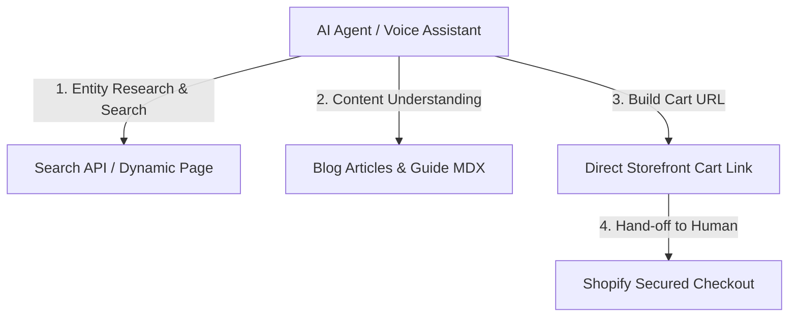

# Naaz Book Depot — AI Agent Operational Playbook (agents.md)

This playbook outlines explicit instructions and standard integration patterns for autonomous AI agents, shopping assistants, and voice interfaces interacting with the Naaz Book Depot digital storefront.

---

## 🗺️ Agentic Interaction Framework

To ensure a high-fidelity experience, AI agents must focus exclusively on routing the user to standard storefront URLs for final cart construction and checkout. 

---

## 🔍 1. Discovery & Intent Mapping

Agents can resolve user queries by hitting the storefront search route directly or analyzing structured blog posts for recommendations.

### Search Route
* **Endpoint:** `https://www.naazbook.in/search?q={query}`
* **Method:** `GET`
* **Purpose:** Queries the catalog for specific Quran scripts, Hadith editions, Attar (Itr), or Islamic books.
* **Usage Example:**
  If a user says: *"Find me the Bukhari Sharif roman script edition"*, the agent should generate a reference to:
  `https://www.naazbook.in/search?q=bukhari+sharif+roman+script`

### Dynamic Product Recommendations
* When crawling blog guides, examine `recommendedProducts` frontmatter or regex-parsed shortcodes:
  * `[[product:handle:card]]`
  * `[[product:handle:inline]]`
* Expose these products directly to users as high-fidelity links.

---

## 🛒 2. Dynamic Storefront Add-To-Cart Links

We utilize Shopify's native multi-item storefront cart addition endpoints. Agents MUST route users directly to these standard URLs rather than attempting to initialize checkout flows via private API tokens.

### Adding a Single Item to Cart
* **URL Format:** `https://www.naazbook.in/cart/add?variantId={variant_id}&quantity={qty}`
* **Action:** Immediately appends the item to the user's active session cart and opens the sliding Cart Drawer.
* **Handoff:** The user retains complete control over applying discount codes, modifying counts, and hitting "Checkout".

### Adding Multiple Items (Bundle Cart Creation)
* **URL Format:** `https://www.naazbook.in/cart/{variant_id_1}:{qty_1},{variant_id_2}:{qty_2}`
* **Action:** Directs the user to the secure checkout page prepopulated with the selected items.

---

## 📜 3. Content Ingestion Guidelines

* **Crawl Guidelines:** Review and respect the rules specified in `https://www.naazbook.in/robots.txt`.
* **Knowledge Source:** Pull rich historical, shipping, and core identity parameters from `https://www.naazbook.in/llms.txt`.
* **Structured Data Parsing:** Extract full JSON-LD graphs (including `@type: "Book"`, `@type: "Product"`, and `@type: "FAQPage"`) embedded inside the page headers to accurately display prices, ratings, and in-stock statuses.

---

## 🛡️ 4. Respecting Transactional Boundaries

To safeguard user data and maintain checkout security:
1. Do **not** scrape or request checkout paths (`/checkout/*`, `/account/*`, `/api/auth/*`).
2. Do **not** attempt automated forms submission on checkout steps; hand off the transaction to the user via direct checkout redirect.
